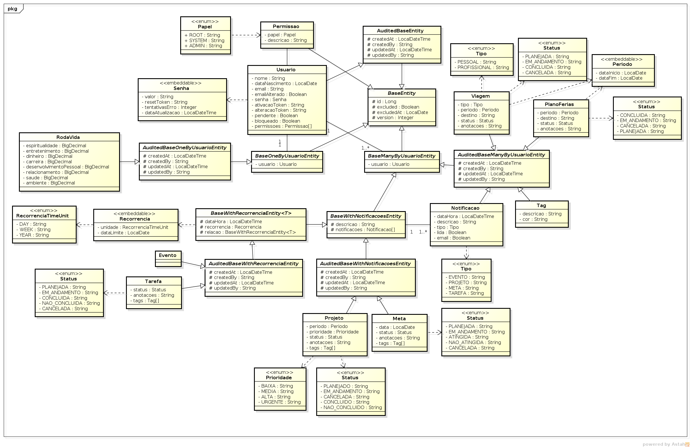

# OpenPlanner API

stable: [](https://travis-ci.org/open-planner/open-planner-api)
develop: [](https://travis-ci.org/open-planner/open-planner-api)

Projeto da disciplina de Engenharia de Software do Mestrado Profissional de Informática do IFPB.

## Requisitos

* Java 11;
* Docker;
* Docker Compose.

## Instalação

Inicialmente deve-se configurar as seguintes variáveis de ambiente no arquivo `docker-compose.dev.yml`:

* MAIL_HOST
* MAIL_PASSWORD
* MAIL_PORT
* MAIL_SENDER
* MAIL_USERNAME

Em seguida executar os seguintes scripts:

```
./build-dev.sh
./start-dev.sh
```

A API estará disponível no endereço http://localhost:8080.

Para parar a execução dos containers deve-se executar o seguinte script:

```
./stop-dev.sh
```

## Funcionalidades

* Autenticação com OAuth2 e JWT
* Controle de Acesso
  * Cadastro com confirmação por e-mail
  * Alteração de Informações Pessoais
  * Alteração de Senha
  * Recuperação de Senha
* Roda da Vida
* Notificações
* Tags
* Viagens
* Planos de Férias
* Eventos
* Projetos
* Metas
* Tarefas

## Diagrama de Classes UML



## Profiles

* **dev**: desenvolvimento
* **prod**: produção

## Principais Properties e Environments

```yml
spring:
  datasource:
    url: ${DB_URL:jdbc:postgresql://localhost:5432/open-planner}
    username: ${DB_USER:user.auth}
    password: ${DB_PASSWORD:user.pass}
  mail:
    host: ${MAIL_HOST:smtp.gmail.com}
    port: ${MAIL_PORT:587}
    username: ${MAIL_USERNAME:username}
    password: ${MAIL_PASSWORD:password}
open-planner-api:
  web-app:
    base-url: ${WEB_APP_BASE_URL:http://localhost:4200}
    mail-activation-path: ${WEB_APP_MAIL_ACTIVATION_PATH:/#/mail-activation/{token}}
    update-mail-path: ${WEB_APP_UPDATE_MAIL_PATH:/#/update-mail/{token}}
    recovery-password-path: ${WEB_APP_RECOVERY_PASSWORD_PATH:/#/recovery-password/{token}}
  access-control-headers:
    allow-origin: ${ACCESS_CONTROL_ALLOW_ORIGIN:*}
    allow-credentials: ${ACCESS_CONTROL_ALLOW_CREDENTIALS:false}
  security:
    oauth2:
      client: ${OAUTH2_CLIENT:auth}
      secret: ${OAUTH2_SECRET:P@55-@uth-1937}
      scopes: ${OAUTH2_SCOPES:read,write}
      authorized-grant-types: ${OAUTH2_AUTHORIZED_GRANT_TYPES:password,refresh_token}
      access-token:
        validity-seconds: ${OAUTH2_ACCESS_TOKEN_VALIDITY_SECONDS:1800}
      refresh-token:
        enabled: ${OAUTH2_REFRESH_TOKEN_ENABLED:true}
        secure-cookie: ${OAUTH2_REFRESH_TOKEN_SECURE_COOKIE:true}
        validity-seconds: ${OAUTH2_REFRESH_TOKEN_VALIDITY_SECONDS:86400}
    jwt:
      signing-key: ${JWT_SIGNING_KEY:0p3n-p1ann3r-ap1}
    maximum-attempts-login: ${MAXIMUM_ATTEMPTS_LOGIN:5}
  mail:
    sender: ${MAIL_SENDER:sender@email.com}
  cron:
    notificacao-service:
      send-mails: ${CRON_NOTIFICACAO_MAILS:0 0/30 * * * *}
  usuario:
    minimum-age: ${USUARIO_MINIMUM_AGE:14}
```

## Swagger

> Habilitado apenas para o profile **dev**

http://localhost:8080/swagger-ui.html

## Postman

* [Collection](/postman/open-planner-api.postman_collection.json)
* [Environment](/postman/open-planner-api.postman_environment.json)
